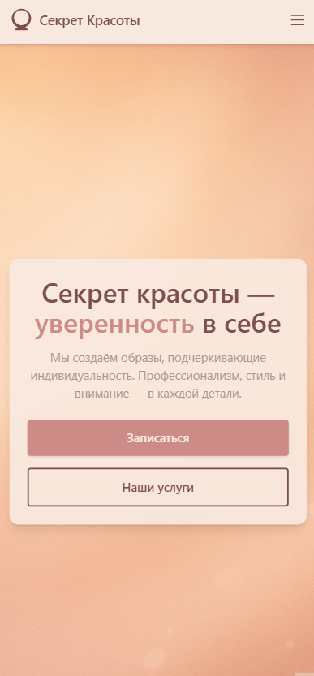

# 💄 Секрет Красоты — Сайт студии красоты

<div align="center">
  
</div>

---

Добро пожаловать в **Secret of Beauty** — элегантный и адаптивный сайт студии красоты.  
Проект создан без фреймворков, с акцентом на дизайн, скорость и лёгкость.  
🔗 [Демо-версия на Netlify](https://secret-of-beauty.netlify.app)

---

## 🎥 Превью

<div align="center">
  
  <p><strong>Главная страница</strong></p>
</div>

<table align="center">
  <tr>
    <td align="center">
      
      <p><strong>Услуги и стиль</strong></p>
    </td>
    <td align="center">
      
      <p><strong>Иконки и бренд</strong></p>
    </td>
  </tr>
</table>

---

## 🚀 О проекте

**Secret of Beauty** — это минималистичный статичный сайт с высокой скоростью загрузки, красивой типографикой и плавными стилями.  
Подходит для презентации студии красоты, бренда или небольшого бизнеса.

---

## 🔥 Основные функции

- 🎨 Элегантный адаптивный дизайн
- 📱 Полная мобильная поддержка
- 🌈 Tailwind CSS — кастомные цвета бренда
- ⚡ Быстрая сборка без фреймворков
- 🧠 Простая архитектура: HTML + PostCSS + JS
- 🔗 Поддержка PWA: `manifest`, `favicon`, иконки

---

## 🛠️ Технологии

- **Tailwind CSS** — утилитарная стилизация
- **PostCSS + Autoprefixer** — сборка стилей
- **Vanilla JS** — интерактивность
- **Custom HTML Builder (Node.js)** — генерация страниц
- **Netlify** — хостинг и деплой

---

## 📂 Структура проекта

```text
secret-of-beauty/
├── assets/               # Иконки, изображения, гифки
│   ├── gifs/
│   └── images/
├── components/           # Повторно используемые HTML-фрагменты
├── css/                  # Исходные стили (input.css)
├── dist/                 # Финальный билд (index.html, output.css)
├── js/                   # JS-скрипты
├── pages/                # Страницы сайта
├── scripts/              # Скрипты генерации HTML
├── .gitignore
├── package.json
├── postcss.config.js
├── tailwind.config.js
├── yarn.lock
└── README.md
